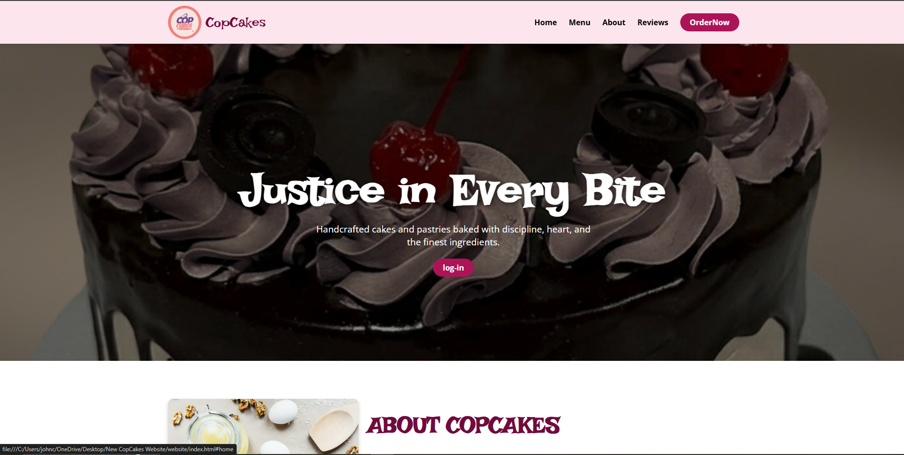
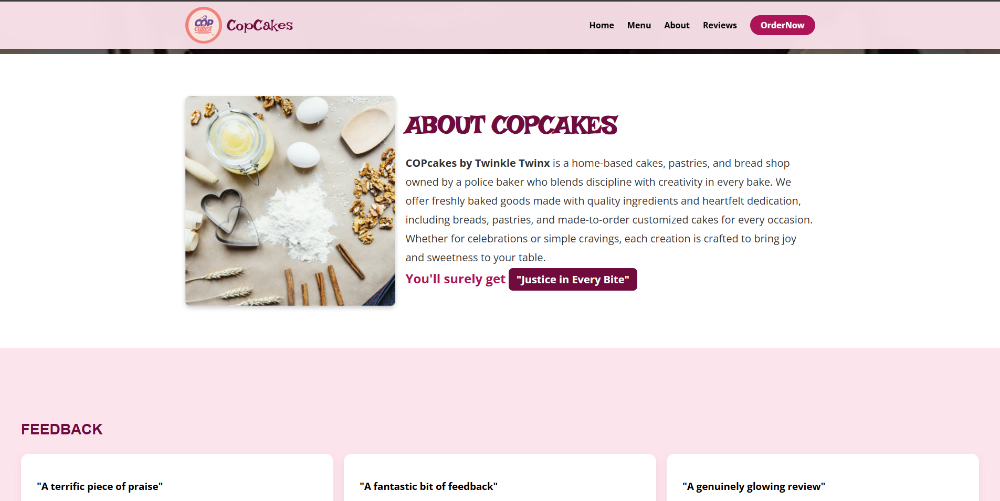
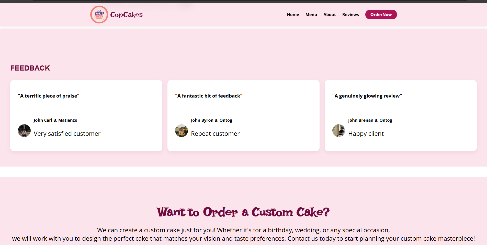
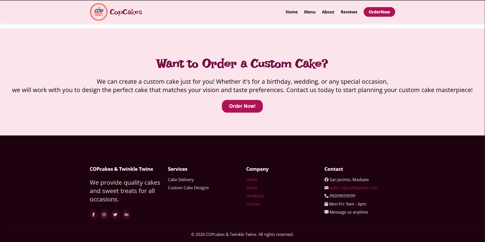
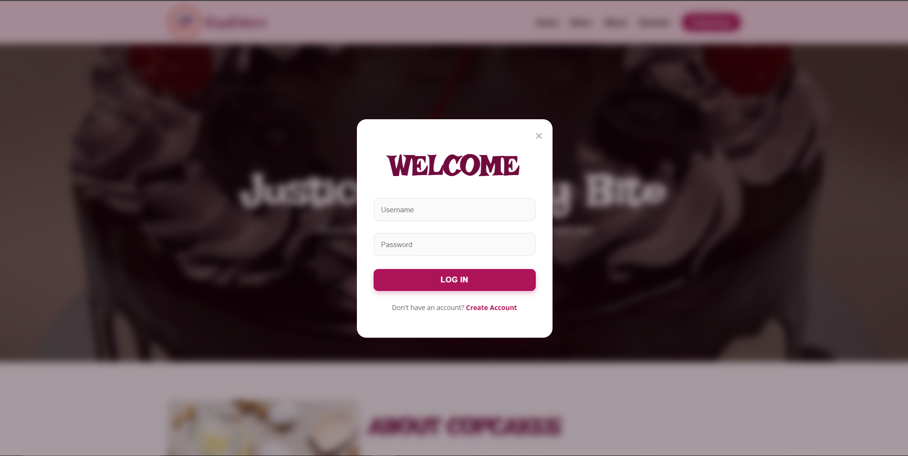
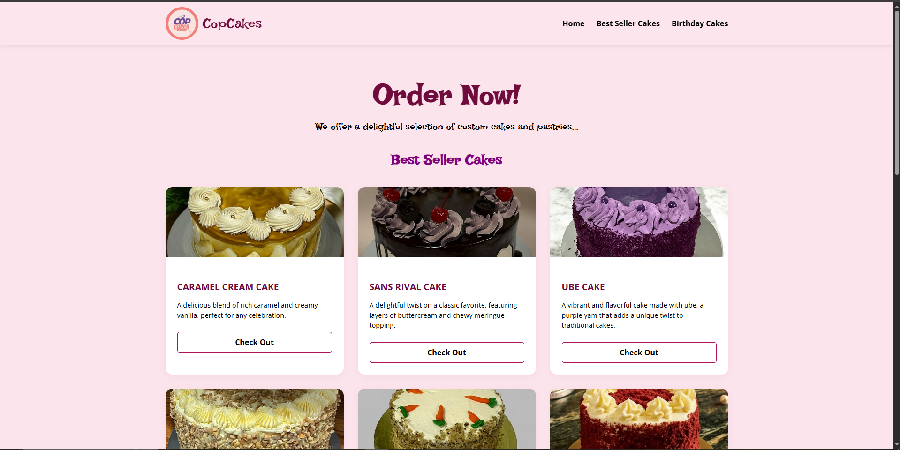
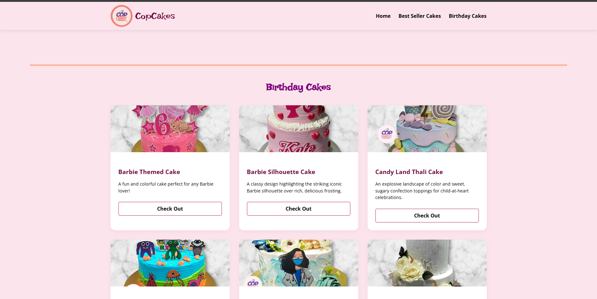

Project Title: COPCAKES WEBISITE(About Selling Cakes)

Student Name: John Carl B. Matienzo
              John Brennan B. Ontog
              John Byron B. Ontog

Course & Section: BSIT 1-Y2-1

Short Project Discription:
    COPCAKES is a responsive cake business website that showcases various cake designs and services. It features a modern layout with a navigation bar, image gallery, and key sections like About and Contact. The website is built using HTML and CSS for a user-friendly experience.

Features Implemented:
    Single-Page Scrolling Navigation
    Multi-Page Structure
    Sticky Header
    Responsive Design (a littile bit not done yet)
    Grid-Based Product Showcase
    Visual Enhancements with Hover Effects and a little bit of animation
    Custom Typography
    External Styling

Screenshot of your webisite:
    
    
    
    
    
    
    